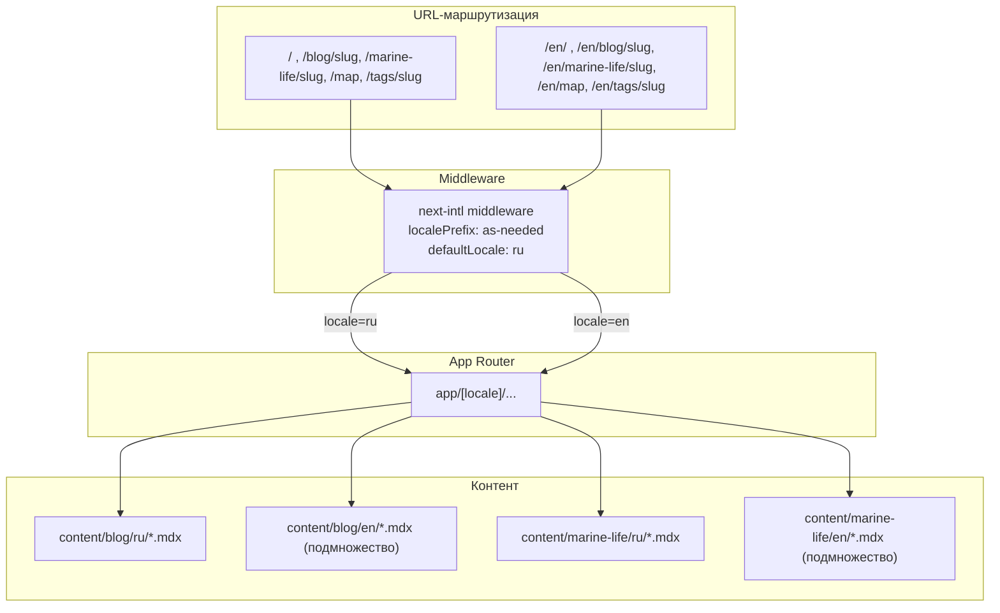
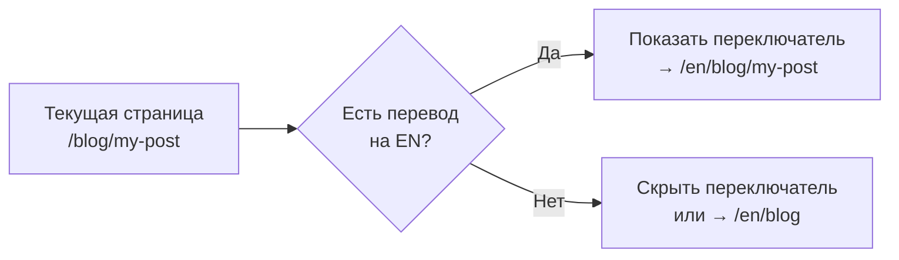

# План миграции на мультиязычную версию (RU + EN)

## Текущее состояние

- Сайт полностью на русском, без языковых префиксов
- `<html lang="ru">` и `locale: "ru_RU"` захардкожены
- ~50+ русских строк захардкожены в компонентах (навигация, поиск, breadcrumbs, карточки, 404 и др.)
- Контент (blog, marine-life) лежит в `content/blog/*.mdx` и `content/marine-life/*.mdx`
- `content/tags.json` имеет поля `slug` + `ru` (без `en`)
- `content/dive-sites.json` уже содержит поля `en` и `ru` (частично готов)
- Редиректы `/ru/*` → `/` настроены; `/en/*` отдаёт 404

## Целевая архитектура



**Принцип маршрутизации:**

- RU (default): без префикса — `/blog/slug` (как сейчас, ничего не меняется для пользователей)
- EN: с префиксом — `/en/blog/slug`
- Middleware определяет locale и пробрасывает в `[locale]` сегмент
- На EN-страницах, где перевода нет, показываем 404 (не fallback на RU)

---

## Фаза 1: Инфраструктура next-intl

### 1.1. Установка next-intl

```bash
pnpm add next-intl
```

### 1.2. Конфигурация локалей

Создать `i18n/routing.ts`:

```typescript
import { defineRouting } from "next-intl/routing";

export const routing = defineRouting({
  locales: ["ru", "en"],
  defaultLocale: "ru",
  localePrefix: "as-needed", // RU без префикса, EN с /en/
});
```

Создать `i18n/request.ts`:

```typescript
import { getRequestConfig } from "next-intl/server";
import { routing } from "./routing";

export default getRequestConfig(async ({ requestLocale }) => {
  let locale = await requestLocale;
  if (!locale || !routing.locales.includes(locale as any)) {
    locale = routing.defaultLocale;
  }
  return {
    locale,
    messages: (await import(`../messages/${locale}.json`)).default,
  };
});
```

### 1.3. Middleware

Создать `middleware.ts` в корне проекта:

```typescript
import createMiddleware from "next-intl/middleware";
import { routing } from "./i18n/routing";

export default createMiddleware(routing);

export const config = {
  matcher: ["/", "/(ru|en)/:path*", "/((?!api|_next|.*\\..*).*)"],
};
```

### 1.4. Обновить `next.config.ts`

Подключить плагин `createNextIntlPlugin`:

```typescript
import createNextIntlPlugin from "next-intl/plugin";
const withNextIntl = createNextIntlPlugin("./i18n/request.ts");
// ... обернуть config: export default withNextIntl(nextConfig);
```

Убрать редиректы `/ru/*` → `/` (они больше не нужны — middleware сам разрулит).

### 1.5. Словари переводов UI

Создать `messages/ru.json` и `messages/en.json`. Структура:

```json
{
  "nav": {
    "blog": "Блог / Blog",
    "marinLife": "Подводный мир / Marine Life",
    "map": "Карта / Map"
  },
  "common": {
    "home": "Главная / Home",
    "readingTime": "{minutes} мин чтения / {minutes} min read",
    "notFound": "Страница не найдена / Page not found",
    "noArticles": "Пока нет статей. / No articles yet.",
    ...
  },
  "search": {
    "placeholder": "Поиск... / Search...",
    "noResults": "Ничего не найдено / Nothing found",
    ...
  },
  ...
}
```

Полный список строк для извлечения (~50 строк из ~15 компонентов):

- [NavLinks.tsx](components/layout/NavLinks.tsx): "Блог", "Подводный мир", "Карта"
- [Footer.tsx](components/layout/Footer.tsx): "RSS-лента", "Контакты", "©..."
- [ThemeToggle.tsx](components/layout/ThemeToggle.tsx): "Переключить тему", "Светлая тема", "Тёмная тема"
- [SearchBox.tsx](components/search/SearchBox.tsx): ~12 строк ("Поиск...", "Загрузка...", "Ничего не найдено", "Блог", "Подводный мир" и др.)
- [ArticleBreadcrumb.tsx](components/article/ArticleBreadcrumb.tsx): "Главная"
- [ArticleWithTocLayout.tsx](components/article/ArticleWithTocLayout.tsx): "Показать оглавление", "Оглавление"
- [CopyLinkButton.tsx](components/article/CopyLinkButton.tsx): тексты кнопки
- [MarineLifeBriefInfo.tsx](components/marine-life/MarineLifeBriefInfo.tsx): ~10 строк ("Краткая информация", "Размер:", "Глубина:" и др.)
- [ImageWithRetry.tsx](components/ImageWithRetry.tsx): "Загрузка…", "Не удалось загрузить", "Повторить"
- [Pagination.tsx](components/blog/Pagination.tsx): "Пагинация", "Предыдущая страница"
- Все page.tsx: metadata titles/descriptions, заголовки, подписи

---

## Фаза 2: Реструктуризация роутинга

### 2.1. Перенести страницы в `app/[locale]/`

Текущая структура → новая:

```
app/layout.tsx              →  app/layout.tsx (минимальный, без locale)
                            +  app/[locale]/layout.tsx (основной, с locale)
app/page.tsx                →  app/[locale]/page.tsx
app/not-found.tsx           →  app/[locale]/not-found.tsx + app/not-found.tsx
app/blog/page.tsx           →  app/[locale]/blog/page.tsx
app/blog/[slug]/page.tsx    →  app/[locale]/blog/[slug]/page.tsx
app/marine-life/page.tsx    →  app/[locale]/marine-life/page.tsx
app/marine-life/[slug]/     →  app/[locale]/marine-life/[slug]/page.tsx
app/map/page.tsx            →  app/[locale]/map/page.tsx
app/tags/page.tsx           →  app/[locale]/tags/page.tsx
app/tags/[slug]/page.tsx    →  app/[locale]/tags/[slug]/page.tsx
```

Файлы, которые НЕ переносятся (остаются на верхнем уровне):

- `app/sitemap.ts` — генерирует URL для обоих локалей
- `app/robots.ts` — общий для всех
- `app/rss.xml/route.ts` — RU-фид (добавим `/en/rss.xml/route.ts` для EN)

### 2.2. Корневой layout (`app/layout.tsx`)

Минимальный — только оборачивает `NextIntlClientProvider`. Тег `<html lang="...">` переезжает в `app/[locale]/layout.tsx`, где `lang` берётся из параметра `locale`.

### 2.3. Локализованный layout (`app/[locale]/layout.tsx`)

```typescript
export default async function LocaleLayout({
  children,
  params
}: {
  children: React.ReactNode;
  params: Promise<{ locale: string }>;
}) {
  const { locale } = await params;
  const messages = (await import(`../../messages/${locale}.json`)).default;

  return (
    <html lang={locale} suppressHydrationWarning>
      <body>
        <NextIntlClientProvider locale={locale} messages={messages}>
          {/* Header, Nav, Footer */}
          {children}
        </NextIntlClientProvider>
      </body>
    </html>
  );
}
```

### 2.4. Обновить все page-компоненты

Каждый page получает `params.locale` и передаёт его в функции загрузки контента и метаданных. Пример `app/[locale]/blog/page.tsx`:

```typescript
export async function generateMetadata({ params }: Props) {
  const { locale } = await params;
  const t = await getTranslations({ locale, namespace: "blog" });
  return buildMetadata({
    title: t("title"),
    description: t("description"),
    path: "/blog",
    locale,
  });
}
```

---

## Фаза 3: Реструктуризация контента

### 3.1. Перенос MDX-файлов в подкаталоги по языку

```
content/blog/*.mdx           →  content/blog/ru/*.mdx
content/marine-life/*.mdx     →  content/marine-life/ru/*.mdx
```

Для EN-переводов (когда появятся):

```
content/blog/en/slug.mdx
content/marine-life/en/slug.mdx
```

Slug остаётся одинаковым для обоих языков — это позволяет легко связывать переводы и строить hreflang.

### 3.2. Обновить `lib/content/blog.ts`

Добавить параметр `locale` во все функции:

```typescript
const BLOG_DIR = path.join(process.cwd(), "content/blog");

function getBlogDir(locale: string) {
  return path.join(BLOG_DIR, locale);
}

export function getAllPosts(locale: string = "ru"): BlogPostMeta[] {
  const dir = getBlogDir(locale);
  // ... загрузка из dir
}

export function getPostRaw(slug: string, locale: string = "ru"): string | null {
  // ... загрузка из content/blog/{locale}/{slug}.mdx
}
```

Аналогично для `lib/content/marine-life.ts`.

### 3.3. Обновить `content/tags.json`

Добавить поле `en` к каждому тегу:

```json
[
  { "slug": "diving", "ru": "дайвинг", "en": "Diving" },
  { "slug": "first-experience", "ru": "первый опыт", "en": "First Experience" },
  { "slug": "phuket", "ru": "пхукет", "en": "Phuket" }
]
```

Обновить `lib/content/tags.ts`:

```typescript
export type Tag = { slug: string; ru: string; en: string };

export function getTagLabel(tag: Tag, locale: string): string {
  return locale === "en" ? tag.en : tag.ru;
}
```

### 3.4. Обновить `lib/format/date.ts`

```typescript
export function formatDate(iso: string, locale: string = "ru"): string {
  const loc = locale === "en" ? "en-US" : "ru-RU";
  return d.toLocaleDateString(loc, {
    day: "numeric",
    month: "long",
    year: "numeric",
  });
}
```

---

## Фаза 4: Локализация компонентов

### 4.1. Server Components

Использовать `getTranslations()` из next-intl:

```typescript
import { getTranslations } from 'next-intl/server';

export default async function BlogPage() {
  const t = await getTranslations('blog');
  return <h1>{t('title')}</h1>;
}
```

### 4.2. Client Components

Использовать `useTranslations()`:

```typescript
'use client';
import { useTranslations } from 'next-intl';

export function NavLinks() {
  const t = useTranslations('nav');
  return <Link href="/blog">{t('blog')}</Link>;
}
```

### 4.3. Навигационные ссылки

Заменить `next/link` на `Link` из `next-intl`:

```typescript
import { Link } from "@/i18n/navigation";
// Автоматически добавляет /en/ для EN-локали
```

Создать `i18n/navigation.ts`:

```typescript
import { createNavigation } from "next-intl/navigation";
import { routing } from "./routing";

export const { Link, redirect, usePathname, useRouter } =
  createNavigation(routing);
```

### 4.4. Переключатель языка (Language Switcher)

Новый компонент в header, рядом с ThemeToggle. Логика:

- На страницах контента: показывать переключатель только если существует перевод
- На статических страницах (главная, /blog, /marine-life, /map, /tags): переключатель всегда доступен
- При переключении: перенаправлять на ту же страницу в другой локали



---

## Фаза 5: SEO для мультиязычности

### 5.1. hreflang теги

Обновить `lib/seo/metadata.ts` — добавить `alternates.languages`:

```typescript
export function buildMetadata({
  title,
  description,
  path,
  locale,
  hasTranslation,
}: MetaInput): Metadata {
  const url = locale === "en" ? `${SITE_URL}/en${path}` : `${SITE_URL}${path}`;

  return {
    // ... существующие поля
    alternates: {
      canonical: url,
      languages: hasTranslation
        ? {
            ru: `${SITE_URL}${path}`,
            en: `${SITE_URL}/en${path}`,
            "x-default": `${SITE_URL}${path}`,
          }
        : undefined,
    },
    openGraph: {
      // ...
      locale: locale === "en" ? "en_US" : "ru_RU",
      alternateLocale: locale === "en" ? ["ru_RU"] : ["en_US"],
    },
  };
}
```

### 5.2. Sitemap с alternates

Обновить `app/sitemap.ts`:

```typescript
// Для статических страниц — всегда оба языка
{
  url: `${SITE_URL}/blog`,
  alternates: {
    languages: {
      ru: `${SITE_URL}/blog`,
      en: `${SITE_URL}/en/blog`,
    }
  }
}

// Для контентных страниц — только если есть перевод
{
  url: `${SITE_URL}/blog/${slug}`,
  alternates: enPostExists ? {
    languages: {
      ru: `${SITE_URL}/blog/${slug}`,
      en: `${SITE_URL}/en/blog/${slug}`,
    }
  } : undefined
}
```

### 5.3. RSS-фиды

- `/rss.xml` — русский фид (как сейчас)
- `/en/rss.xml` — английский фид (только переведённые посты)

Создать `app/[locale]/rss.xml/route.ts` или отдельные роуты.

### 5.4. JSON-LD

Обновить breadcrumbs и Article schema — подставлять локализованные названия ("Главная"/"Home", "Блог"/"Blog").

---

## Фаза 6: Поиск

### 6.1. Обновить `scripts/build-search-index.js`

Генерировать индекс с учётом локали:

```json
{
  "ru": [
    { "title": "...", "path": "/blog/slug", "category": "blog", ... }
  ],
  "en": [
    { "title": "...", "path": "/en/blog/slug", "category": "blog", ... }
  ]
}
```

### 6.2. Обновить `SearchBox.tsx`

- Загружать только записи текущей локали
- UI-строки через `useTranslations()`
- Пути результатов с учётом префикса

---

## Порядок реализации (итерациями)

Каждая итерация проверяема локально.

**Итерация 1** — next-intl base + routing без контента (сайт работает как раньше, но через [locale])
**Итерация 2** — словари UI + замена захардкоженных строк
**Итерация 3** — реструктуризация контента (blog/ru/, blog/en/) + обновление lib/content
**Итерация 4** — переключатель языка
**Итерация 5** — SEO (hreflang, sitemap alternates, OG locale)
**Итерация 6** — поиск с учётом локали
**Итерация 7** — RSS для EN + финальная проверка

---

## Файлы, которые будут затронуты

**Новые файлы (~8):**

- `middleware.ts`
- `i18n/routing.ts`
- `i18n/request.ts`
- `i18n/navigation.ts`
- `messages/ru.json`
- `messages/en.json`
- Компонент `LanguageSwitcher`
- `app/en/rss.xml/route.ts` (или `app/[locale]/rss.xml/route.ts`)

**Перемещаемые файлы (~12):**

- Все page.tsx из `app/` → `app/[locale]/`
- `app/layout.tsx` → разделяется на корневой + `app/[locale]/layout.tsx`
- Все MDX-файлы из `content/blog/` → `content/blog/ru/`
- Все MDX-файлы из `content/marine-life/` → `content/marine-life/ru/`

**Модифицируемые файлы (~20):**

- `next.config.ts` — плагин next-intl, убрать /ru/ редиректы
- `lib/content/blog.ts` — параметр locale
- `lib/content/marine-life.ts` — параметр locale
- `lib/content/tags.ts` — поле en, getTagLabel()
- `lib/seo/metadata.ts` — hreflang, locale-aware
- `lib/seo/config.ts` — возможно без изменений
- `lib/format/date.ts` — параметр locale
- `content/tags.json` — добавить поле en
- `app/sitemap.ts` — alternates
- `app/robots.ts` — возможно без изменений
- `scripts/build-search-index.js` — индекс по локалям
- `components/layout/NavLinks.tsx` — useTranslations + i18n Link
- `components/layout/Footer.tsx` — useTranslations
- `components/layout/ThemeToggle.tsx` — useTranslations
- `components/search/SearchBox.tsx` — useTranslations + locale filter
- `components/article/ArticleBreadcrumb.tsx` — useTranslations
- `components/article/ArticleWithTocLayout.tsx` — useTranslations
- `components/article/CopyLinkButton.tsx` — useTranslations
- `components/marine-life/MarineLifeBriefInfo.tsx` — useTranslations
- `components/ImageWithRetry.tsx` — useTranslations
- `components/blog/Pagination.tsx` — useTranslations
